# Functionaliteiten
Zoals ik al aangaf in de algemene README, zullen deze functionaliteiten diegene zijn waaraan ik gewerkt heb gedurende het hele project. 
Zo wordt het bestand niet te uitgebreid als ik elke functionaliteit zou uitleggen.

## Bestemmingen
Alle code voor de onderstaande functionaliteiten kan je terugvinden in de bestanden in onderstaande directories.

#### Configuration
- `MapperProfile.cs`

#### Controllers
- `BestemmingController.cs`

#### Repository (Data/Repo)
- `BestemmingRepo.cs`
- `IBestemmingRepo.cs`

#### Models
- `Bestemming.cs`

#### ViewModels
- `BestemmingViewModel.cs`
- `BestemmingEditViewModel.cs`
- `BestemmingDeleteViewModel.cs`

#### Views
- `Bestemming`

| Screenshot | Uitleg |
| ----------- | ----------- |
| 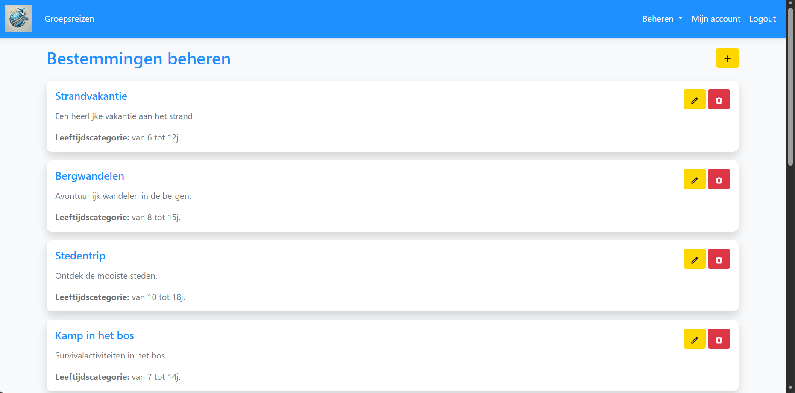 | Als je als admin bent ingelogd kan je bestemmingen beheren, die aan een reis gekoppeld kunnen worden. Op dit scherm staat een overzicht van alle bestaande bestemmingen die al dan niet al aan een reis gekoppeld zijn. Om een bestemming toe te voegen, druk je op de '+' knop rechtsboven.  |
| 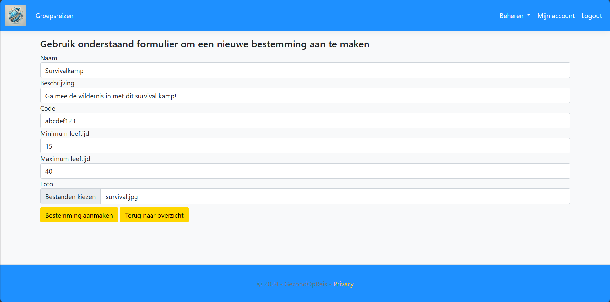 | Na het drukken op de '+' knop, kom je op dit scherm terecht waar je een bestemming kunt aanmaken door de velden in te vullen. Als je klaar bent, druk dan op de linkse knop 'Bestemming aanmaken'. Indien je deze toch niet wilt toevoegen, druk je op de rechtse knop 'Terug naar overzicht'. Deze brengt je, zoals de naam aangeeft, terug naar het overzicht van alle bestemmingen.  |
| 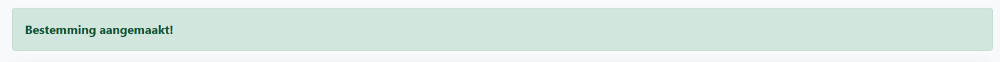 | Na het toevoegen krijg je, als alles goed verlopen is, deze alert bovenaan te zien. De nieuwe bestemming is dus met succes toegevoegd.  |
| 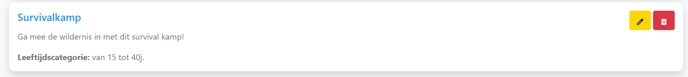 | Als je dan naar beneden zou scrollen, zal je inderdaad de nieuwe bestemming in de lijst zien staan. |
| 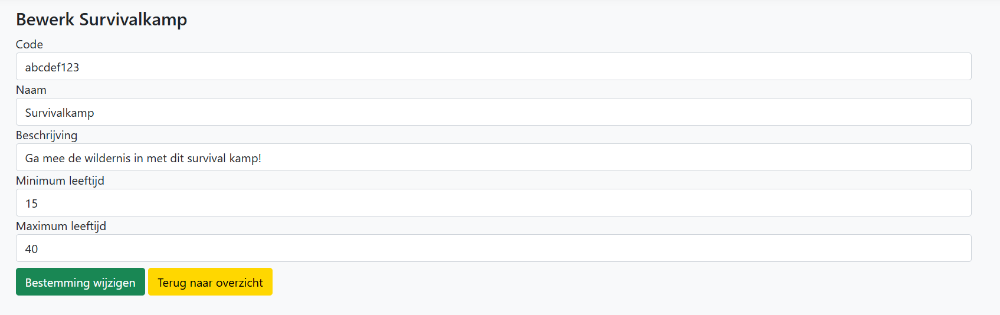 | Naast het toevoegen van nieuwe activiteiten, kun je ze, door op het 'pennetje' te drukken gaan bewerken. Hier ga je de naam en de beschrijving kunnen aanpassen, indien je dit wilt. Als je dan op de groene knop drukt gelabeled 'Bestemming wijzigen', dan zullen alle wijzigingen worden doorgevoerd. Je zal dan opnieuw een alert te zien krijgen, maar nu met de boodschap dat de wijzigingen zijn aangepast. Indien je niets wilt veranderen kan je altijd op de gele knop gelabeled 'Terug naar overzicht' drukken. |
| 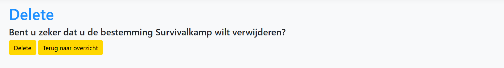 | Je hebt ook de mogelijkheid om bepaalde bestemmingen te verwijderen. Dit doe je door op het vuilbakje te drukken. Je krijgt dan deze confirmatie. Indien je hier op de linkerknop 'Delete' zou drukken, dan wordt deze uit de database verwijderd. Je krijgt hierna ook weer een alert dat meegeeft dat de actie is gelukt. Ook hier is de rechtse knop 'Terug naar overzicht' voor als je de gekozen activiteit toch niet wilt verwijderen. |

## Activiteiten
Alle code voor de onderstaande functionaliteiten kan je terugvinden in de bestanden in onderstaande directories.

#### Configuration
- `MapperProfile.cs`

#### Controllers
- `Controllers/ActiviteitenController.cs`

#### Repository (Data/Repo)
- `ActiviteitenRepo.cs`
- `IActiviteitenRepo.cs`

#### Models
- `Activiteit.cs`

#### ViewModels
- `ActiviteitViewModel.cs`, 
- `ActiviteitEditViewModel.cs`, 
- `ActiviteitDeleteViewModel.cs`

#### Views
- `Activiteit`

| Screenshot | Uitleg |
| ----------- | ----------- |
| 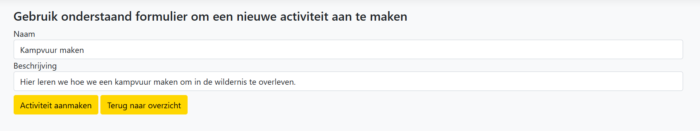 | Als je als admin bent ingelogd kan je een nieuwe activiteit toevoegen door op '+' te drukken op de overzichtspagina. De overzichtspagina van de activiteiten is gelijkaardig aan die van de bestemmingen. Hier kan je een naam geven aan de activiteit samen met een beschrijving. Als je deze hebt ingevuld, druk je op de linkse knop gelabeled 'Activiteit aanmaken', die je terug zal brengen naar het overzicht van alle activiteiten. |
| 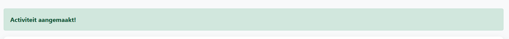 | Na het toevoegen krijg je, als alles goed verlopen is, deze alert bovenaan te zien. De nieuwe activiteit is dus met succes toegevoegd. |
| 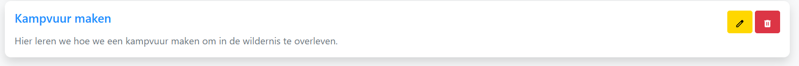 | Als je dan naar beneden zou scrollen, zal je inderdaad de nieuwe activiteit in de lijst zien staan. |
| 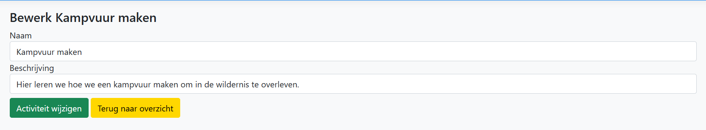 | Naast het toevoegen van nieuwe activiteiten, kun je ze, door op het 'pennetje' te drukken gaan bewerken. Hier ga je de naam en de beschrijving kunnen aanpassen, indien je dit wilt. Als je dan op de groene knop drukt gelabeled 'Activiteit' wijzigen, dan zullen alle wijzigingen worden doorgevoerd. Je zal dan opnieuw een alert te zien krijgen, maar nu met de boodschap dat de wijzigingen zijn aangepast. Indien je niets wilt veranderen kan je altijd op de gele knop gelabeled 'Terug naar overzicht' drukken. |
| 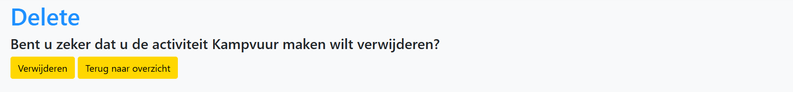 | Je hebt ook de mogelijkheid om bepaalde activiteiten te verwijderen. Dit doe je door op het vuilbakje te drukken. Je krijgt dan deze confirmatie. Indien je hier op de linkerknop 'Verwijderen' zou drukken, dan wordt deze uit de database verwijderd. Je krijgt hierna ook weer een alert dat meegeeft dat de actie is gelukt. Ook hier is de rechtse knop 'Terug naar overzicht' voor als je de gekozen activiteit toch niet wilt verwijderen. |

## Dashboard
Alle code voor de onderstaande functionaliteiten kan je terugvinden in de onderstaande bestanden of directories.

- `Controllers/DashboardController.cs`
- `ViewModels/DashboardViewModel.cs`
- `Views/Dashboard`

| Screenshot | Uitleg |
| ----------- | ----------- |
| 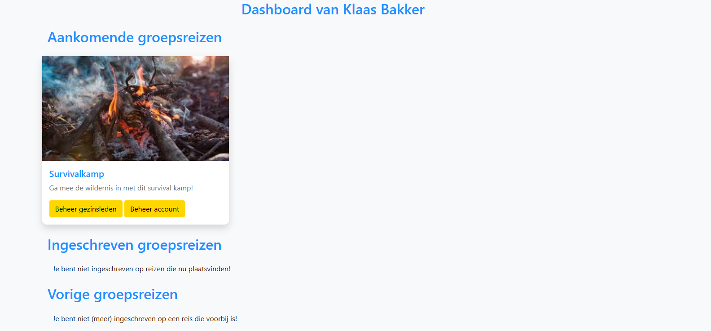 | Als je bent ingelogd kan je, door linksboven op het logo te drukken, je dashboard bekijken. Je dashboard is opgedeeld in drie verschillende delen, de aankomende, de huidige en de afeglopen reizen. Als de startdatum van de reis in de toekomst ligt, dan zal de reis, waarvoor je je kind hebt ingeschreven, op deze manier getoond worden. Vanaf deze weergave kan je ook rechtstreeks je gezinsleden beheren, maar ook je account. Dit kan je doen doen door respectievelijk de linkse en rechtse knop aan te klikken, zowel bij dit en de andere schermen. |
| 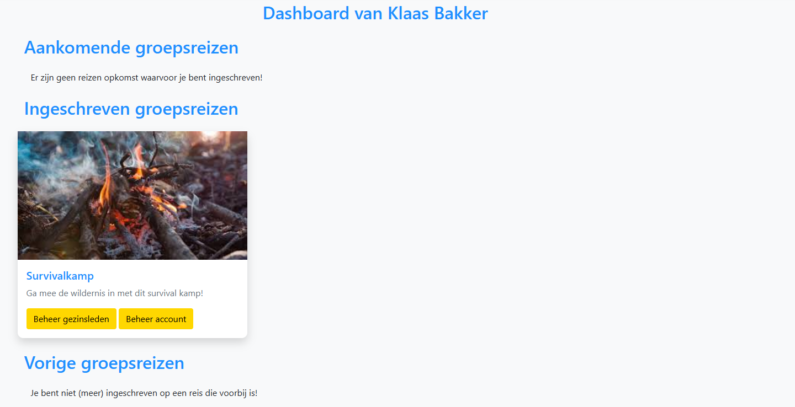 | Als de startdatum van een ingeschreven reis in het verleden liggen, maar de einddatum ligt nog in de toekomst, dan zal de reis op deze manier getoond worden. Deze reizen veranderen dynamisch van categorie, dus ze moeten niet manueel verplaatst worden door de admin. Als je je kind op geen andere reizen hebt ingeschreven bij andere categorieën zouden staan, dan zal je ook de gepaste mededeling krijgen, zoals je kunt zien op dit en de andere 2 schermen. |
| 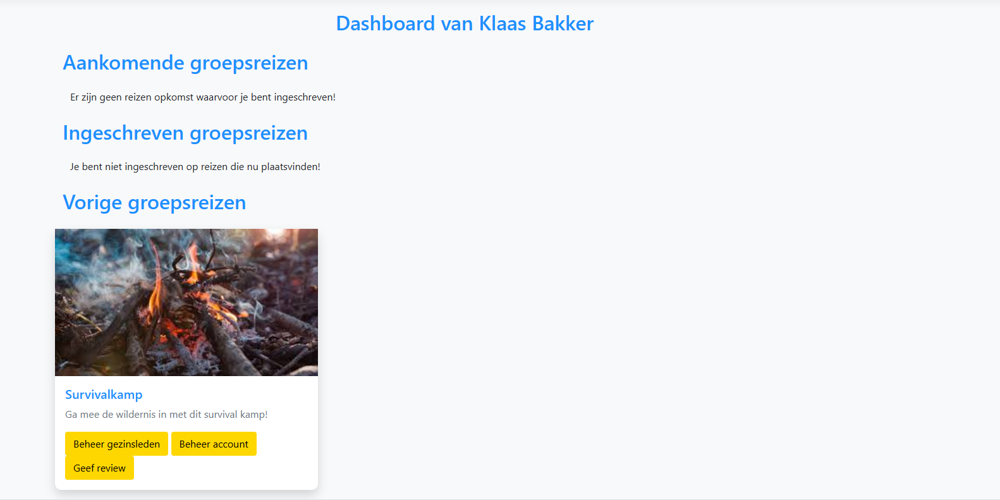 | Tenslotte, als de einddatum van de ingeschreven reis in het verleden ligt, dan zal deze op deze manier getoond worden op het dashboard. Deze reizen blijven een totaal van een maand zichtbaar. Nadien verdwijnen ze van het dashboard. Naast de 2 beheerknoppen, kan je hier ook een review gaan geven van zodra de reis afgelopen. De knop onderaan, gelabeled 'Geef review' zal je een review laten toevoegen aan de reis.  |

## Reviews
Alle code voor de onderstaande functionaliteiten kan je terugvinden in de bestanden in onderstaande directories.

#### Configuration
- `MapperProfile.cs`

#### Controllers
- `ReviewController.cs`

#### Repository (Data/Repo)
- `Data/Repo/ReviewRepo.cs`
- `Data/Repo/IReviewRepo.cs`

#### Models
- `Models/Review.cs`

#### ViewModels
- `ReviewViewModel.cs`
- `ReviewCreateViewModel.cs`
- `ReviewEditViewModel.cs`

#### Views
- `Review`

| Screenshot | Uitleg |
| ----------- | ----------- |
| 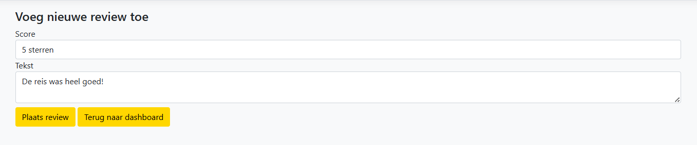 | Door op de 'Geef review' knop te drukken van het vorige scherm, zal je op dit scherm terechtkomen. Hier kan je, zoals je kan zien, het aantal sterren geven en je bijhorende commentaar. Als je tevreden bent met je review, druk je op de linkse knop gelabeled 'Plaats review'. Dit brengt je terug naar het dashboard, maar voegt tegelijkertijd de review toe aan de reis. Wil je geen review plaatsen? Gebruik dan de rechtse knop 'Terug naar dashboard' om naar je dashboard terug te keren. |
| 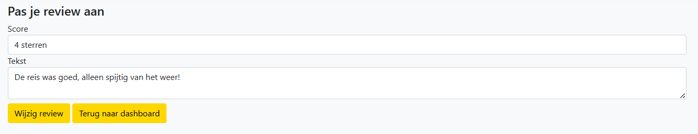 | Mocht je je review willen wijzigen, dan is dit ook een mogelijkheid. Druk simpelweg terug op de linkse knop bij de reis waar je je review hebt geplaatst. Aangezien er al een review van jou bestaat, kun je eventueel het aantal sterren of je commentaar zelf aanpassen. Als je klaar bent, druk je op de linkse knop 'Wijzig review' om de wijzigingen op te slaan. Zoals het vorige scherm heb je hier ook de mogelijkheid om naar het dashboard terug te keren, mocht je geen wijzigingen willen doorvoeren. |
| 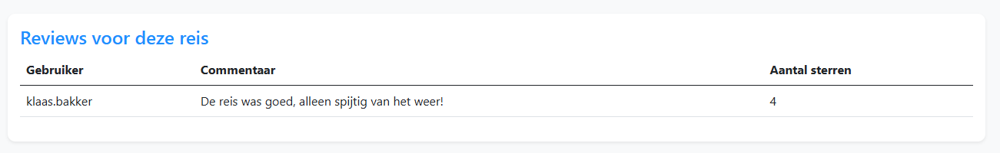 | Of je nu een review hebt toegevoegd aan een reis, of deze hebt aangepast, de review zal op deze manier op de detailpagina van een groepsreis getoond worden. Wijzigingen worden direct doorgevoerd en zal hier ook updaten. |

## Gezinsleden
Alle code voor de onderstaande functionaliteiten kan je terugvinden in de bestanden in onderstaande directories.

#### Configuration
- `MapperProfile.cs`

#### Controllers
- `KindController.cs`

#### Repository (Data/Repo)
- `KindRepository.cs`
- `IKindRepository.cs`

#### Models
- `Kind.cs`
- `Deelnemer.cs`
- `CustomUser.cs`

#### ViewModels
- `ViewModels/DeelnemerDetailsViewModel.cs`
- `ViewModels/KindViewModel.cs`
- `ViewModels/KindEditViewModel.cs` 
- `ViewModels/KindCreateViewModel.cs`
- `ViewModels/KindDeleteViewModel.cs`
- `ViewModels/GroepsreisInfoViewModel.cs`

#### Views
- `Kind`
- `GroepsReis/ReisInfo.cshtml`

| Screenshot | Uitleg |
| ----------- | ----------- |
| 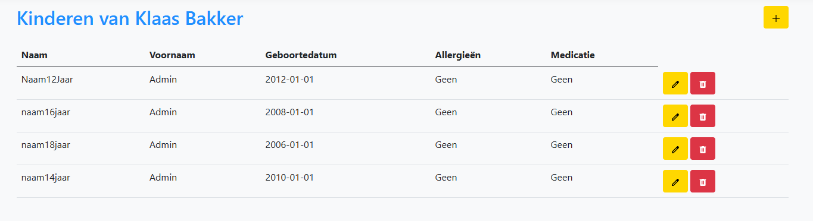 | Als je als ouder bent ingelogd en je drukt op de 'Gezinsleden beheren' knop, dan kom je op dit scherm terecht. Hier zie je een overzicht van alle kinderen die je hebt toegevoegd. Voor een nieuw kind toe te voegen aan de lijst, druk je op de '+' rechtsbovenaan. |
| 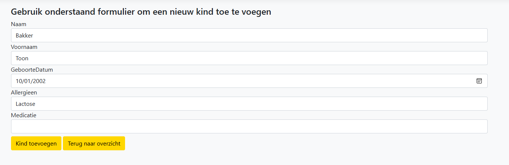 | Als je op de '+' knop drukt, kom je op dit scherm terecht, waar je een kind kunt toevoegen. Als je kind geen allergieën of medicijnen zou hebben, dan kun je deze perfect leeg laten, want deze worden automatisch met 'Geen' opgevuld bij het aanmaken. Hier kun je ook de rechtse knop gebruiken om terug te gaan naar het overzicht van kinderen. Om je kind toe te voegen, druk je op de linkse knop 'Kind toevoegen'. |
| 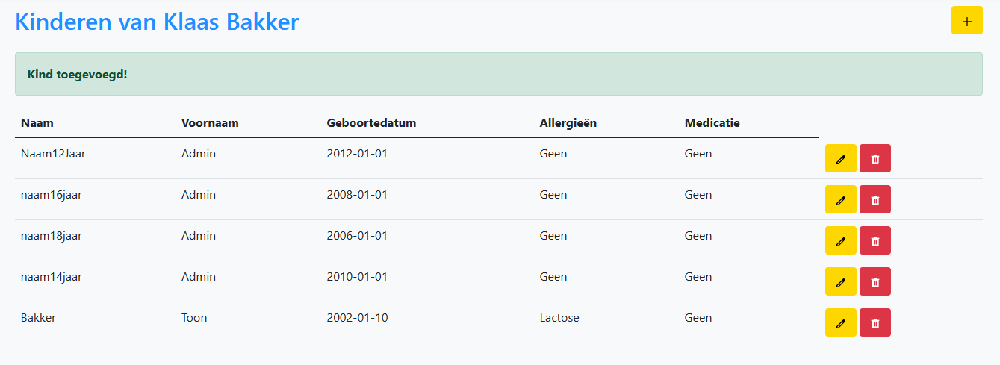 | Als alles goed verlopen is, zal je na een druk op de submit-knop, terug op dit scherm terechtkomen, deze keer met het nieuwe kind onderaan de lijst toegevoegd. Je krijgt ook een alert te zien die aangeeft dat de actie goed gelukt is. |
| 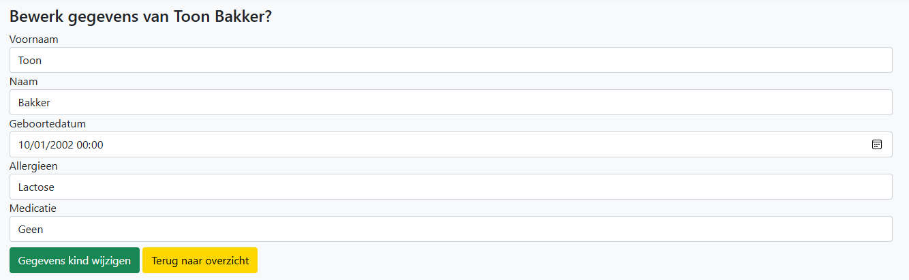 | Mocht je bepaalde gegevens van je kind willen aanpassen, dan druk je op het 'pennetje', waarna je op dit scherm wijzigingen kunt aanbrengen. Als je toch medicijnen of een allergie zou willen toevoegen, verander je dit gewoon in het tekstveld. De 'Geen' wordt enkel opgevuld als er niets in het veld wordt ingevuld. Om je wijzigingen door te voeren, druk je op de groene knop. Dit brengt je terug naar het overzicht, met opnieuw een alert die aangeeft dat de actie goed verlopen is. De wijzigingen zijn dan ook al zichtbaar in de lijst. De gele knop, is, nogmaals, de knop om terug te keren naar het overzicht, moest je toch geen wijzigingen willen aanbrengen. |
| 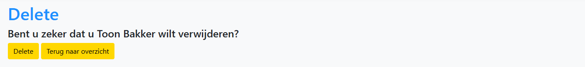 | Zoals alle delete acties, krijg je hier een confirmatie of je al dan niet het geselecteerde kind wilt verwijderen. Om een kind te verwijderen druk je hier, zoals bij de andere acties, op het vuilbakje. Een druk op de 'Delete' knop zal het kind uit de lijst verwijderen. De 'Terug naar overzicht' knop zal je hier ook naar het overzicht terugbrengen. |
| 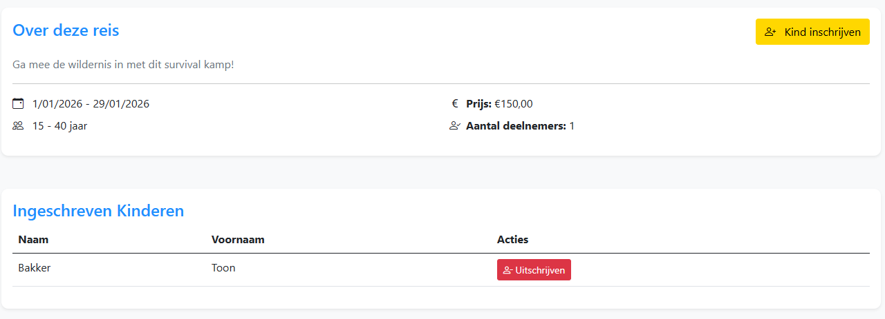 | Als je kinderen hebt toegevoegd en deze graag wilt inschrijven voor een reis, dan kan je dat doen via de detailpagina van een groepsreis, die je kunt bereiken door op de 'Meer informatie' knop te drukken op de homepage, waar alle actieve en aankomende reizen worden getoond. Door op de gele knop 'Kind inschrijven' te drukken, zal je een pop-up krijgen. In deze pop-up kan je kiezen welk kind je graag wilt inschrijven en eventuele opmerkingen kunt meegeven. Als je daar op de submit-knop zou drukken, dan zal het kind op deze manier getoond worden. Indien je je kind wilt uitschrijven, druk dan op de rode knop 'Uitschrijven'. Hier krijg je een pop-up confirmatie. Afhankelijk van je antwoord hierop, zal je kind van de reis uitgeschreven worden en uit de lijst verwijderd worden.  |